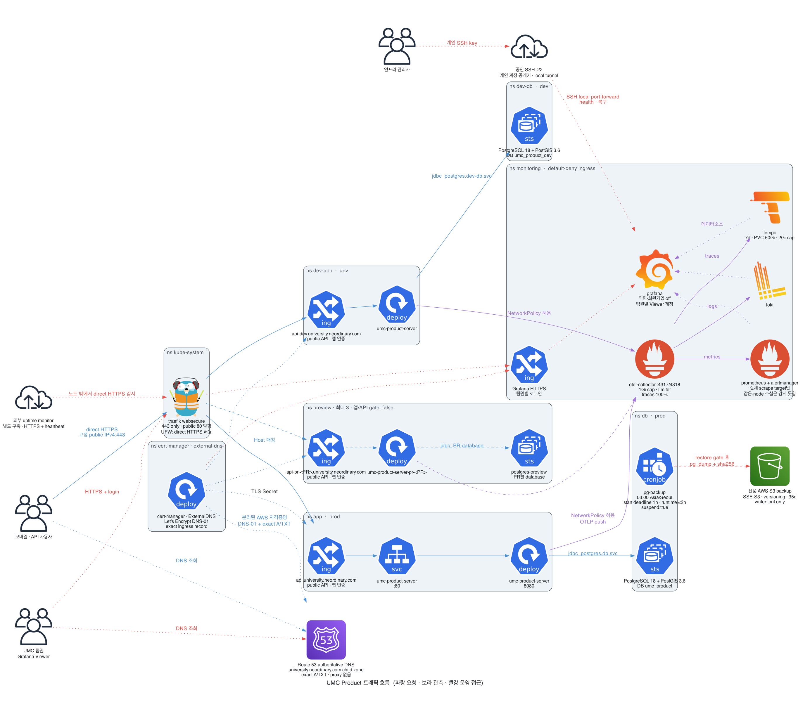
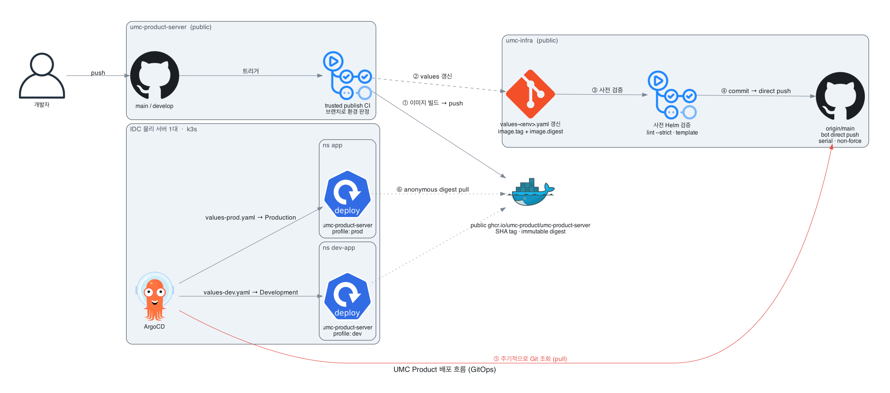
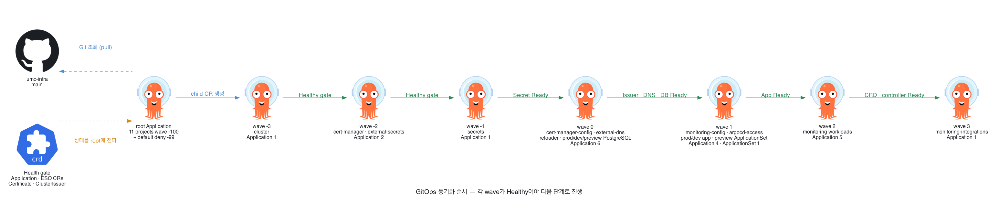
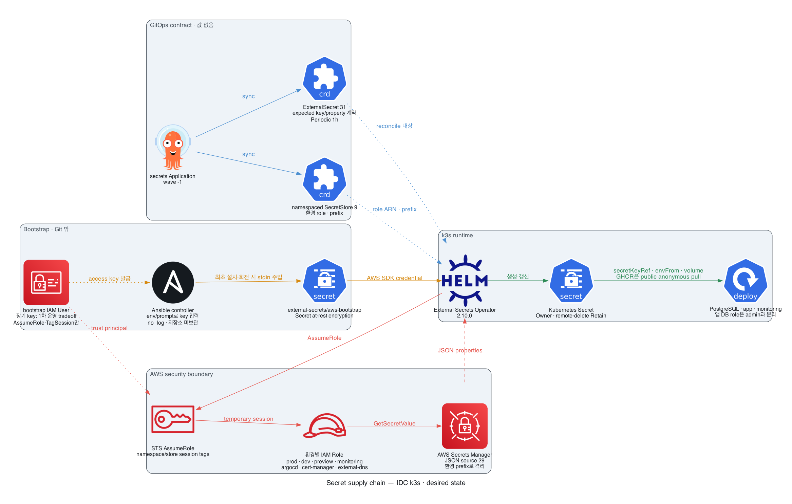
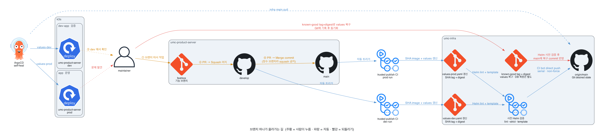
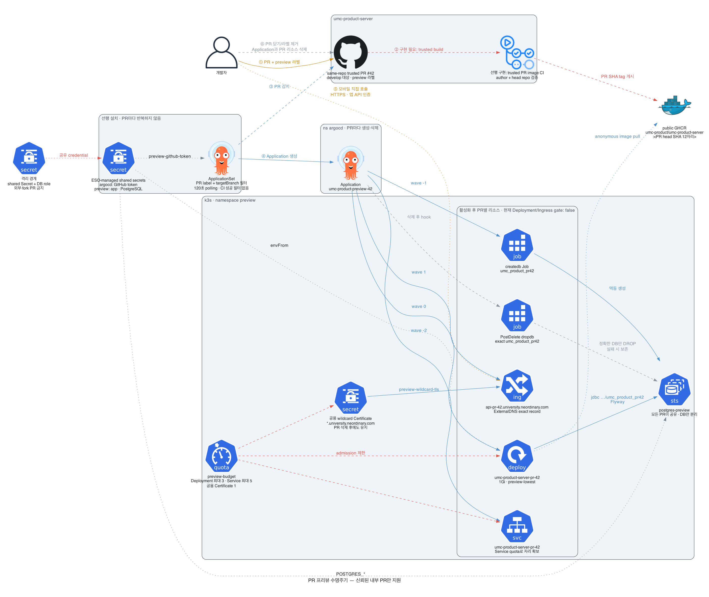

# umc-infra

UMC Product의 단일 노드 K3s 클러스터를 선언적으로 운영하는 GitOps 저장소다.
서버 초기 구성부터 앱·DB·DNS/TLS·관측·AWS 외부 자원의 계약을 관리한다.

모니터링을 보려면 [Grafana](https://grafana.university.neordinary.com)에 로그인한다.
처음에는 [어떤 상황에 어떤 대시보드를 볼까?](observability/README.md#어떤-상황에-어떤-대시보드를-볼까)에서
시작한다. 대시보드 목록과 CPU·메모리 수치를 읽을 때의 주의점도 함께 정리했다.

> [!IMPORTANT]
> 현재 values에서 prod/dev 앱과 API Ingress는 활성화되어 있다. 새 서버는 DB 복원 전에 앱을 시작하지 않도록
> [이전 runbook](runbooks/cafe24-migration.md)의 준비 단계를 따른다. Preview 앱·API와 예약 backup은 비활성 상태다.
> 공개 주소의 실제 Certificate·DNS·HTTPS 준비 상태는 배포 후 별도로 확인한다.

## 인프라 다이어그램

처음 보는 경우 아래 순서대로 읽는다. 이미지를 누르면 원본 크기로 열리고, 생성 코드는
[다이어그램 디렉터리](docs/diagrams/README.md)에서 확인할 수 있다.

### 1. Traffic flow

사용자 요청, DNS/TLS, 앱·DB, backup과 관측 데이터의 전체 경로다.

[](docs/diagrams/out/traffic-flow.png)

### 2. CI/CD flow

Backend CI가 GHCR에 이미지를 게시하고, 선택한 환경 values를 사전 검증한 뒤
infra `main`에 직접 반영하여 K3s에 배포하는 경로다.

[](docs/diagrams/out/cicd-flow.png)

### 3. GitOps tree

Argo CD root Application부터 환경과 platform workload까지의 동기화 순서다.

[](docs/diagrams/out/gitops-tree.png)

### 4. Secret supply chain

로컬 원장의 비밀값이 AWS Secrets Manager와 External Secrets를 거쳐 Pod에 도달하는 경로다.

[](docs/diagrams/out/secret-supply-chain.png)

### 5. Branch flow

기능 브랜치가 dev와 prod로 승격되고 문제가 생기면 복구되는 경로다.

[](docs/diagrams/out/branch-flow.png)

### 6. Preview environment

승인된 PR의 preview 환경이 생성·검증·삭제되는 수명주기다.

[](docs/diagrams/out/preview-env.png)

## 작업 시작점

문서를 전부 순서대로 읽을 필요는 없다. 하려는 작업의 시작점 하나만 연다.

| 하려는 일 | 시작점 |
|---|---|
| 빈 서버에 처음 설치하거나 Ansible을 재실행 | [Ansible README](ansible/README.md) |
| Secret을 추가·변경·회전 | [비밀값 관리](docs/guides/secrets.md) |
| DNS·TLS·Route 53을 변경 | [도메인과 TLS](docs/guides/domains-tls.md) |
| 장애·느린 API·서버 자원 사용량 확인 | [상황별 대시보드 안내](observability/README.md#어떤-상황에-어떤-대시보드를-볼까) |
| backup을 처음 활성화 | [Backup activation runbook](runbooks/backup-activation.md) |
| 구조와 용어가 낯섦 | [저장소 처음 읽는 가이드](docs/guides/repository-tour.md) |
| 이 구조를 선택한 이유를 확인 | [K3s 아키텍처 결정 기록](docs/architecture/k3s.md) |

## 무엇을 관리하나

| 계층 | 도구 | 이 저장소의 위치 | 역할 |
|---|---|---|---|
| 서버 초기 구성 | Ansible | `ansible/` | Ubuntu·개인 SSH 계정/DB 터널·UFW·K3s·Argo CD |
| GitOps | Argo CD | `bootstrap/`, `argocd/` | Git과 Kubernetes 상태 일치 |
| 애플리케이션 | Helm | `charts/umc-product-server/` | prod/dev/preview 공통 배포 계약 |
| 비밀값 공급 | External Secrets | `charts/umc-secrets/` | AWS source를 namespace별 Secret으로 동기화 |
| 앱 Secret 반영 | Reloader | `argocd/applications/platform/reloader.yaml` | 승인한 Secret 변경 시 단일 앱 Pod 재시작 |
| 데이터 | Kubernetes manifest | `manifests/postgres/` | PostgreSQL 18·PostGIS 3.6·backup |
| DNS/TLS | ExternalDNS·cert-manager | `argocd/`, `manifests/cert-manager/` | DNS record와 Let's Encrypt 인증서 |
| 관측 | Prometheus·Loki·Tempo·OTel·Grafana | `observability/`, `argocd/` | metrics·logs·traces·alert |
| AWS 외부 자원 | CloudFormation | `cloud/aws/` | IAM·Secrets Manager 접근·S3·SES·Route53 |

Terraform은 사용하지 않는다. CloudFormation은 AWS 외부 자원에만 사용하고, Kubernetes 자원은
Argo CD가 관리한다. Azure VM 또는 최종 IDC 생성, 상위 도메인의 NS 위임과 backend 코드는
이 저장소의 관리 범위가 아니다.

## 폴더 지도

```text
umc-infra/
├── ansible/                 # 빈 서버 → K3s·Argo CD
├── bootstrap/               # Argo CD root Application
├── argocd/                  # AppProject와 환경별 Application
├── charts/                  # 앱과 ExternalSecret Helm chart
├── manifests/               # cluster·DB·TLS·관측 raw manifest
├── cloud/aws/               # IAM·S3·SES·Route53 CloudFormation
├── observability/           # dashboard와 alert 원본
├── docs/                    # 아키텍처·작업 가이드
├── runbooks/                # backup 활성화 절차
└── scripts/                 # 생성·검증·일회성 bootstrap 도구
```

## 환경

환경별 host 계약은 다음과 같다.

| 환경 | source | namespace | API host |
|---|---|---|---|
| prod | `main` | `app`, `db` | `api.university.neordinary.com` |
| dev | `develop` | `dev-app`, `dev-db` | `api-dev.university.neordinary.com` |
| preview | trusted PR head SHA | `preview` | `api-pr-<PR>.university.neordinary.com` |

환경별 DB, resource, S3/SES와 확장 조건은 [아키텍처 결정 기록](docs/architecture/k3s.md),
DNS와 접근 정책은 [도메인/TLS 가이드](docs/guides/domains-tls.md)를 따른다.

## 현재 Git 설정과 남은 운영 확인

| 영역 | Git desired state | 판단 | 실제 다음 단계 |
|---|---|---|---|
| DNS | Cafe24 `1.255.226.166`, ExternalDNS filter `/32` | 이관 대상 설정 | 전환 gate 검증 후 A·TXT 레코드 확인 |
| TLS | Let's Encrypt production | 설정 완료 | Certificate의 최신 generation이 `Ready=True`인지 확인 |
| Grafana | public Ingress 활성 | 배포 후 확인 | HTTPS 접속, 로그인과 팀원 권한 확인 |
| prod/dev 앱 | `deployment.enabled: true`, image tag·digest 고정 | Git 활성 | 새 IDC는 DB 복원 뒤 앱 시작·migration·probe 검증 |
| prod/dev API | `ingress.enabled: true` | Git 활성 | DNS 전환 전에 새 IDC의 인증서·HTTPS·API 인증 확인 |
| Preview API | Deployment·Ingress 비활성 | 잠금 유지 | 신뢰된 PR 이미지 발행 CI를 만든 뒤 활성화 |
| DB backup | `suspend: false`, 매일 03:00 KST | 예약 실행 | 최초 S3 업로드·클러스터 외부 복원 검증 후 활성화; 정규 실행의 marker와 복원 가능성을 계속 확인 |
| root/cluster 자동 삭제 | `prune: false` | 안전장치 유지 | 첫 운영 안정화와 삭제 복구 절차 검증 후 재검토 |

Cafe24 IP 전환 PR을 merge하면 기존 클러스터의 Argo CD와 ExternalDNS에도 새 target이 반영될 수 있다.
기존 클러스터의 root·DNS controller가 전환 전 상태를 유지하도록 중지·고정한 것을 먼저 검증하고,
새 IDC의 검증을 마친 뒤 승인된 전환 순서로 DNS를 갱신한다.
[Cafe24 이전 runbook](runbooks/cafe24-migration.md)의 준비·DB 복원·검증·DNS 전환 단계를 따른다.

`설정 완료`는 실제 서비스 검증 완료를 뜻하지 않는다. DNS와 TLS controller는 클러스터가
동작한 뒤 레코드와 Certificate를 만든다. prod/dev의 현재 values는 Deployment·Ingress가 활성화되어
있으므로 새 IDC의 준비 단계에서는 해당 Application 생성을 보류해야 한다. Argo CD는 prod/dev Application 안에서
Certificate → Deployment → Ingress 순서로 기다린다. Preview는 공용 wildcard Certificate가
`Ready=True`인 것을 확인한 뒤 PR 이미지 발행과 함께 연다.

## 로컬 검증

저장소 루트에서 실행한다.

```bash
./scripts/validate.sh
```

Helm render, YAML과 Kubernetes schema, CloudFormation, Ansible, 관측 설정과 저장소 자체 계약을
검사한다. 로컬에 필요한 도구가 없으면 일부 단계가 skip될 수 있으므로 전체 출력을 읽고,
첫 bootstrap 전에는 GitHub Actions의 성공도 확인한다.
